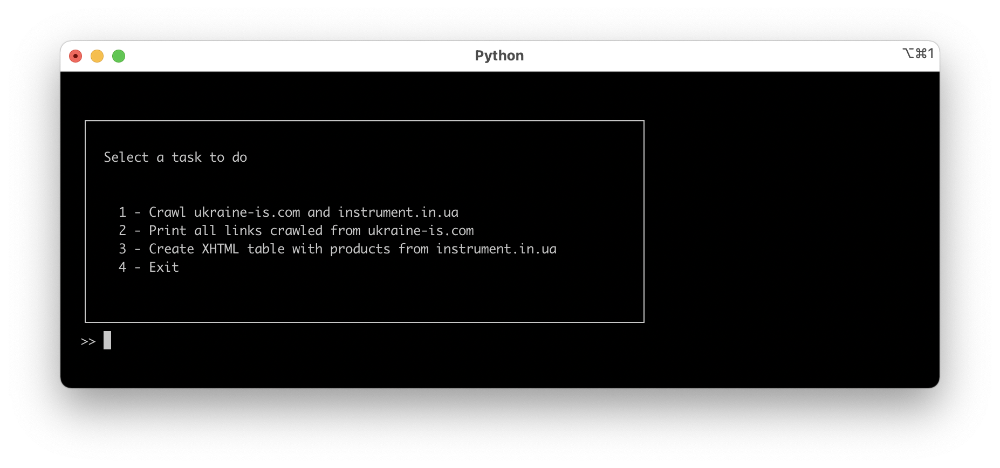
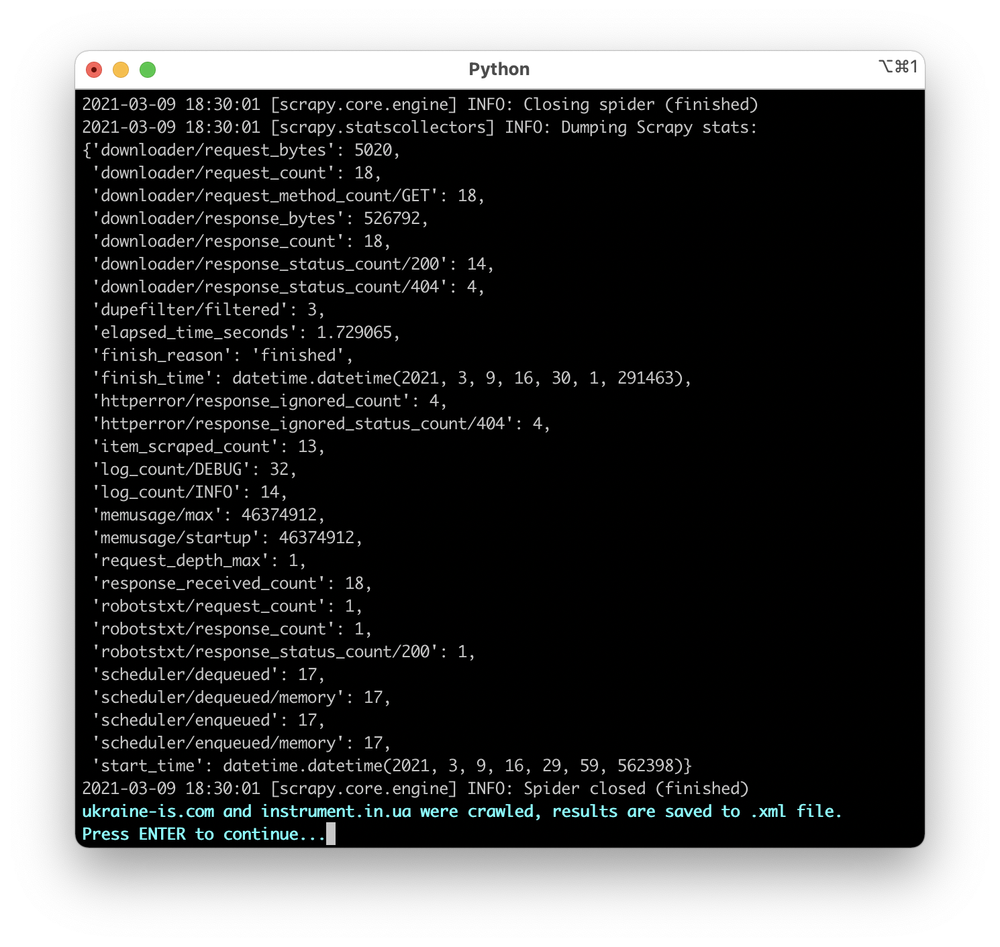
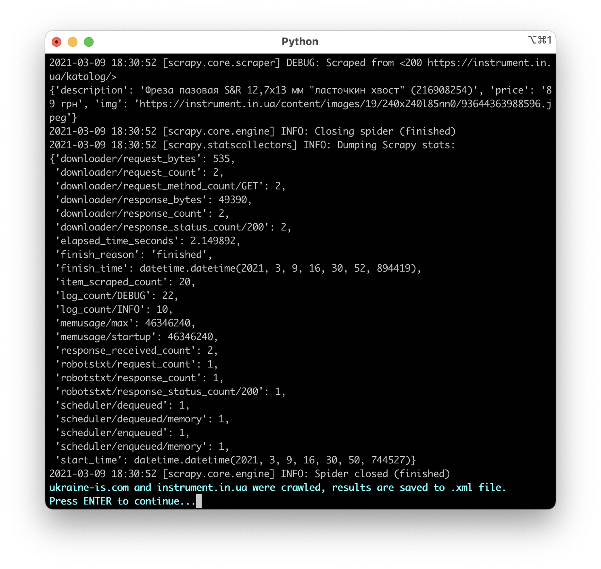
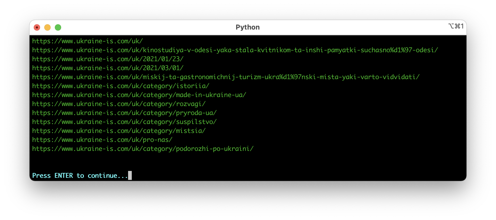

# Лахман Ксенія, КП-82

## [Лабораторна робота 1](https://docs.google.com/document/d/18O5GwX_0XLJP00G2XTXIvxcVxEDCgao9dGG5hZXaHC4/edit?usp=sharing): Вивчення базових операцій обробки XML-документів

## Варіант 11

|Варіант| Базова сторінка (завдання 1) | Зміст завдання 2     | Адреса інтернет-магазину (завдання 3) |
|------------------------------|------------------------------|----------------------|---------------------------------------|
|11| www.ukraine-is.com          | Вивести список гiперпосилань | www.instrument.in.ua |

## Приклади роботи програми

  <b> Main menu </b>
  

  <b> Crawling www.ukraine-is.com </b>
  

  <b> Crawling www.instrument.in.ua </b>
  

  <b> Task 2 - links clawled from www.ukraine-is.com </b>
  

  <b> Task 3 - generated .xslt table</b>
  

