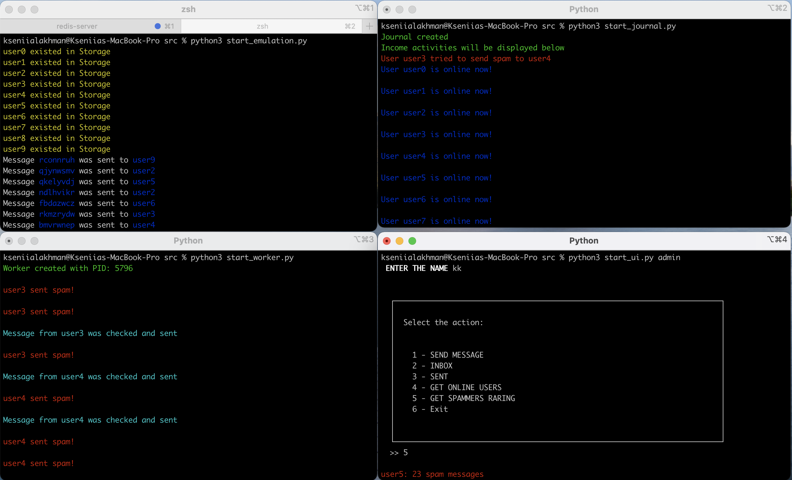
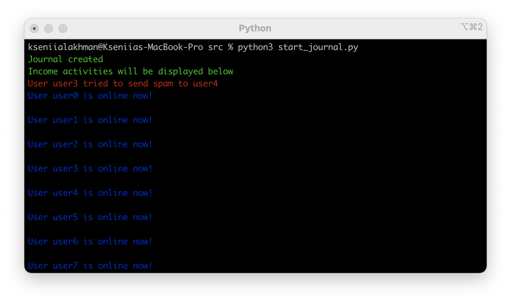
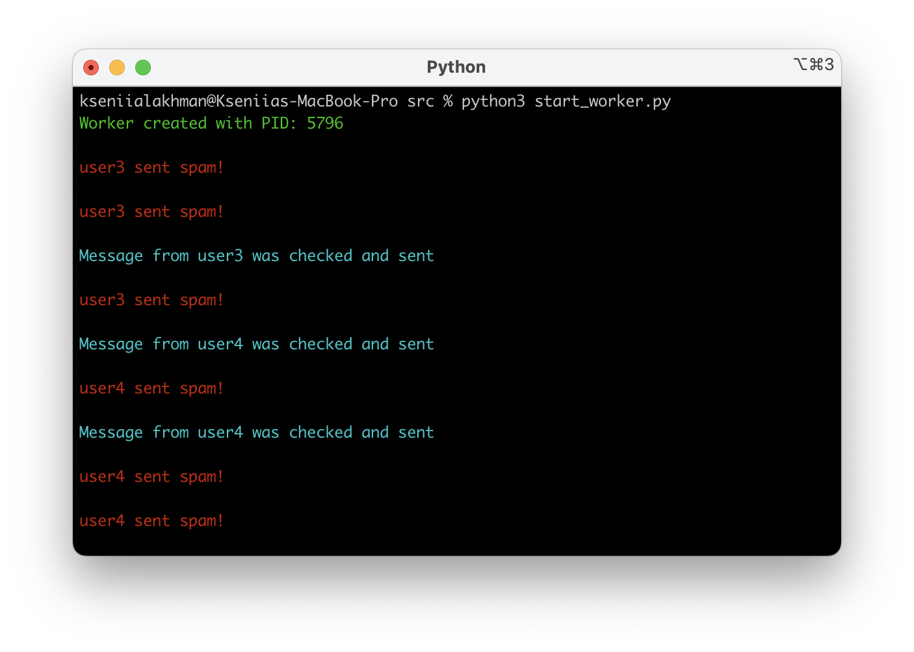
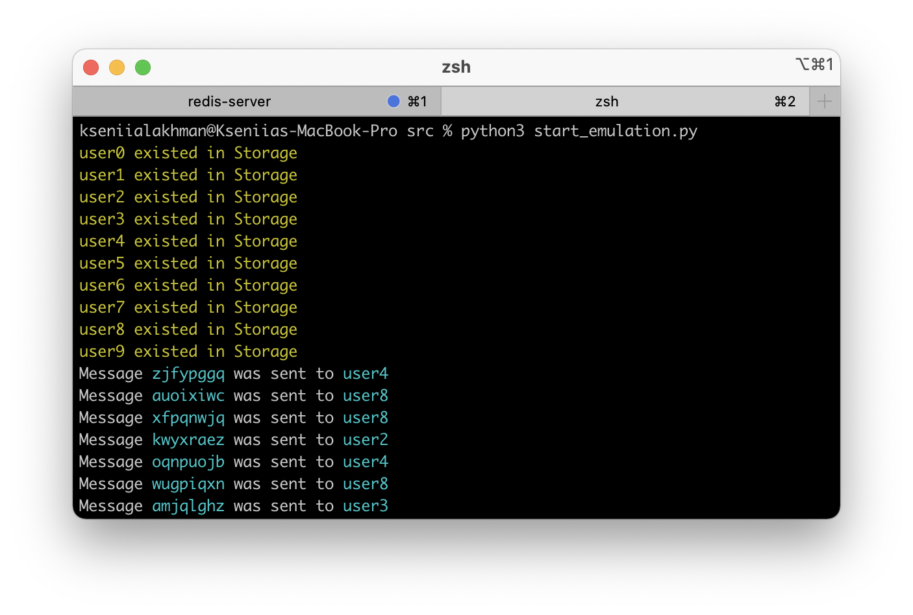
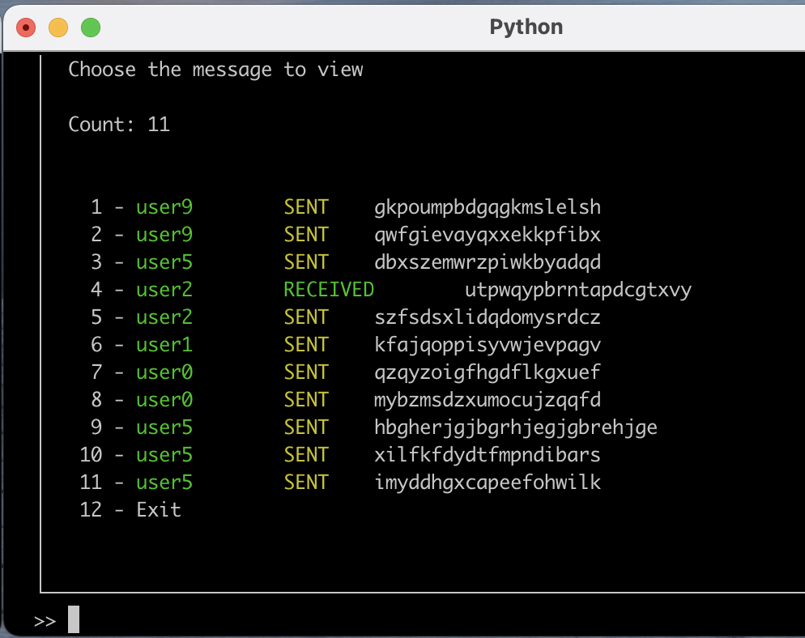
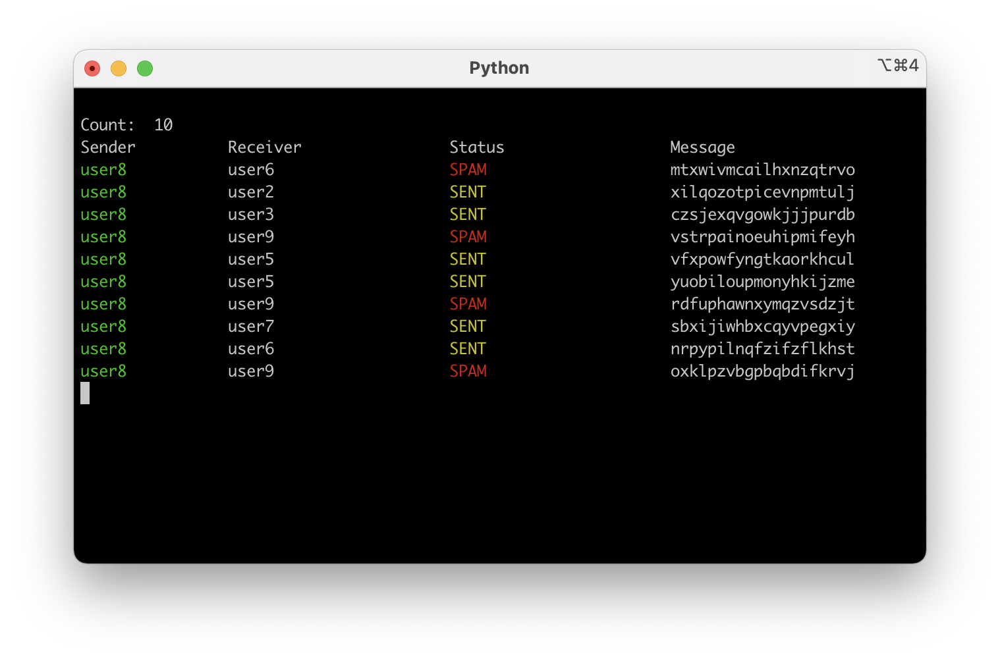
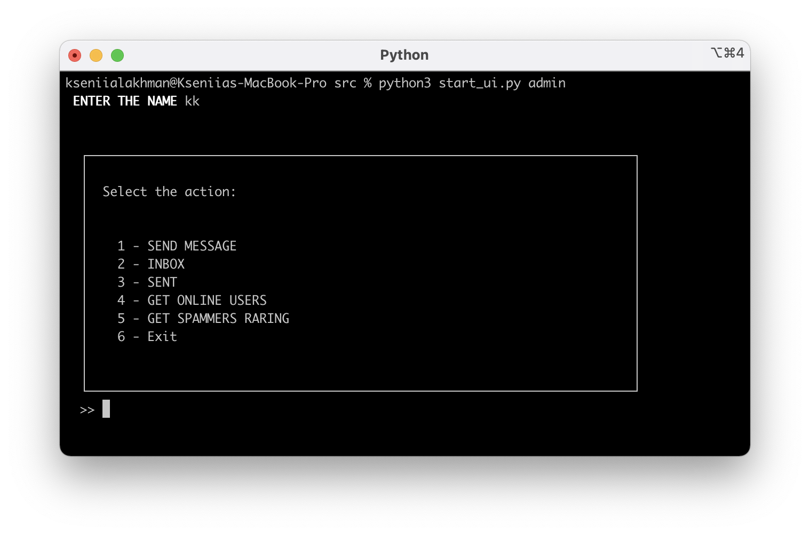
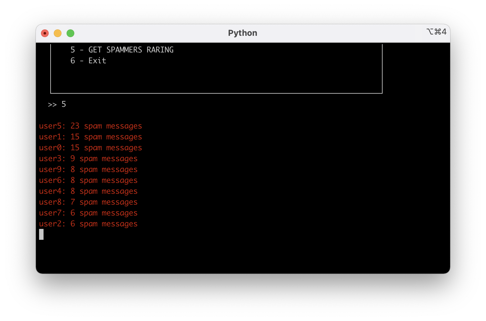

# Лахман Ксенія, КП-82

## [Умова](https://docs.google.com/document/d/1ymkaZA5xorduipavVCKliBGvg-ZYH5rm1Pyfwuu6AUM/edit)
## [Звіт до лабораторної роботи](https://docs.google.com/document/d/1nyHxrUgLmViHwNB_sfPq8gEUUIcnSV9ewtPh2EOg4Wo/edit?usp=sharing)
_____
## Lab2

You can download program work record here: `screens/work_record.mov`

_____

### Журналізація

_____
### Журналізація 

_____

### Worker

_____

### Емуляція

_____

### Вхідні повідомлення

  

_____

### Відправлені повідомлення

_____
### Меню адміністратора

_____
### Топ спамерів

_____
